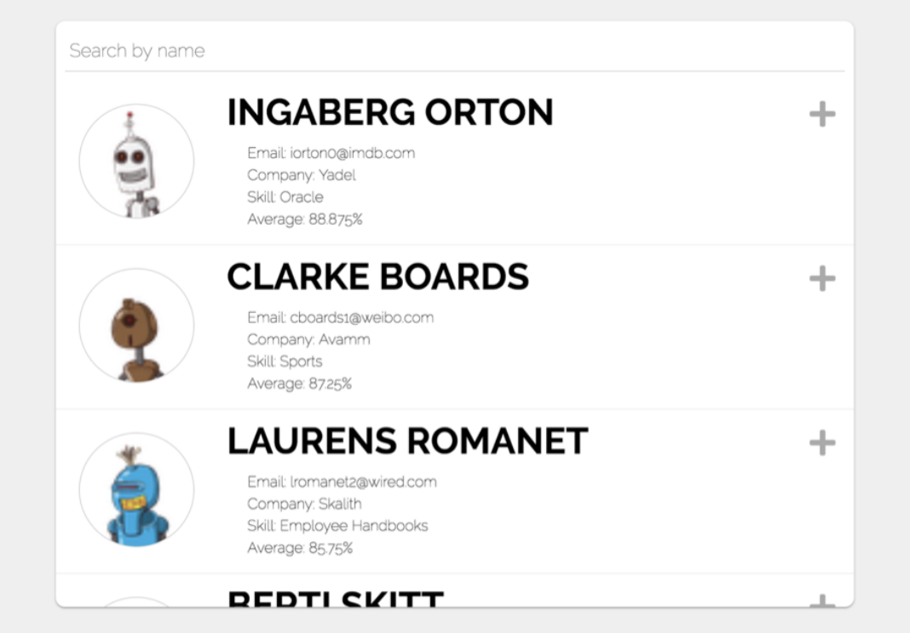
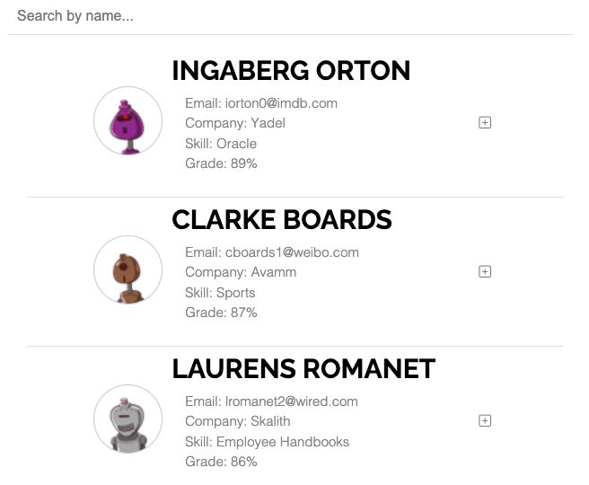

# hatchways_Assessment

### _This application is Celeste Moore's Front-End Assessment submitted via Hatchways._

## Table of Contents

- [Media](#Media)

- [Deployed Site](#deployed-site)

- [Features](#Features)

- [Contributors](#Contributors)

- [Contact](#Contact)

- [Project Status](#project-status)

- [License](#License)

## Media

What was required:  

What I've built:  

## Deployed Site

   [Here is the link to the deployed application.](https://celestealexmoore.github.io/hatchways_Assessment/)

## Features
    - Single-page application built with HTML, CSS and JavaScript.
    - Responsive CSS to adapt to mobile device

## Contributors

This application was created by Celeste Moore.

## Contact

If you have any questions about this repository, contact celestealexmoore via GitHub or reach out via email:
celestealexmoore@gmail.com.

## Project Status

In Progress- Working on step 5/5.

---

## License

© 2021 _celestealexmoore_